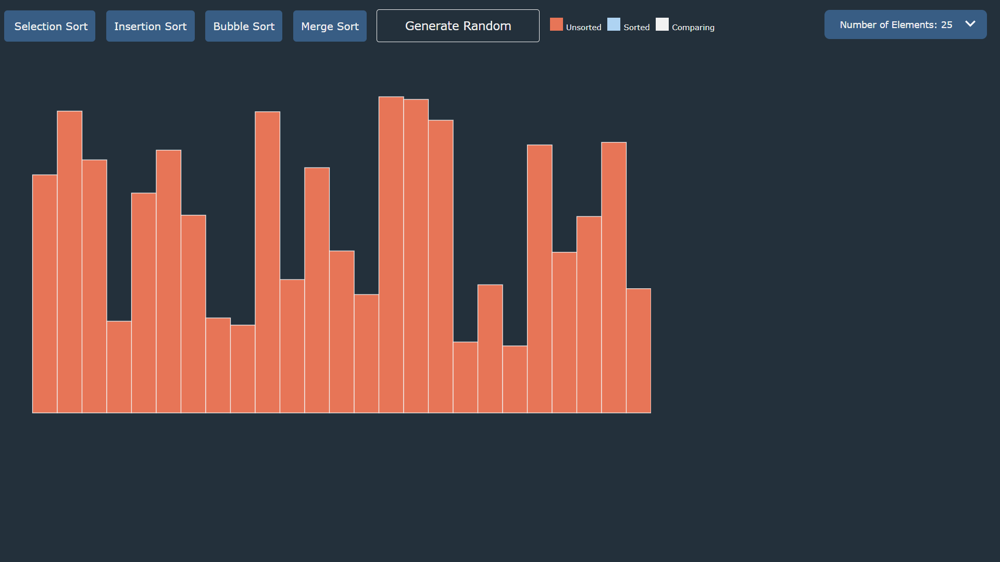

# Sorting Algorithm Visualizer

Able to visualize four types of commonly used sorting algorithms such as selection sort, insertion sort, bubble sort, and merge sort.

## Usage

```bash
1. Select the number of elements.
2. Press the generate random button to create new elements randomly.
3. Choose the sorting algorithm desired and it will be visualized.
```

## Image

